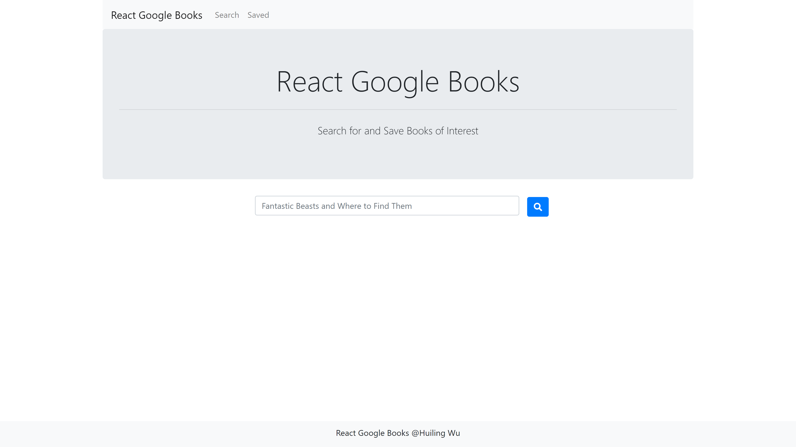
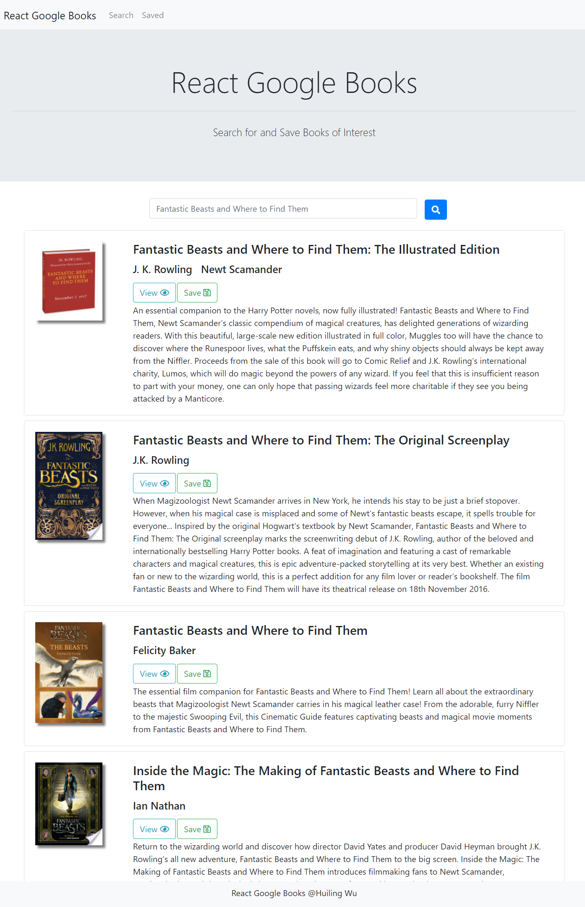

# NYT-Google-Books-Search

<p align="center">
  
</p>

## Getting Started
These instructions will get you a copy of the project up and running on your local machine for development and testing purposes.
* Install [nodejs](https://nodejs.org/en/) for backend server.
* Install [MongoDB](https://www.mongodb.com/) for database. 

After finish setting up the above, clone this project to your local machine and we can go to the next step.

### Installing
`cd NYT-Google-Books-Search` and run the command below to install everything for the server.
```
npm install
```
Then run the command below to change directory to client and install React project for front end.
```
install
```

### Database Set Up
Use Mongodb, and Mongoose to access database
* Book schema
    * title 
    * arthors
    * description
    * image - book cover
    * link - google book link

The database grows as more books get searched and saved.

### Running the tests
To run a local testing server, go to the root directory of this project and run this command in your terminal:
```
node server
```
Now the local server is running on port 3001 in your local machine.

`cd client` to React project directory and run this in your terminal:
```
yarn start
```
React is running on port 3000. Open your browser and visit http://localhost:3000.

### Usage Example
* This is a single page application that uses `react-router-dom` to navigate, hide and show React components without changing routes within Express.

<p align="center">
  
</p>

<p align="center">
  
</p>

## Deployed to Heroku
Check out this project here: https://react-google-books-huilingwu.herokuapp.com/

## Meta

Huiling Wu 
* huwu@ucdavis.edu
* https://github.com/huwu55
* https://www.linkedin.com/in/huwu55/
